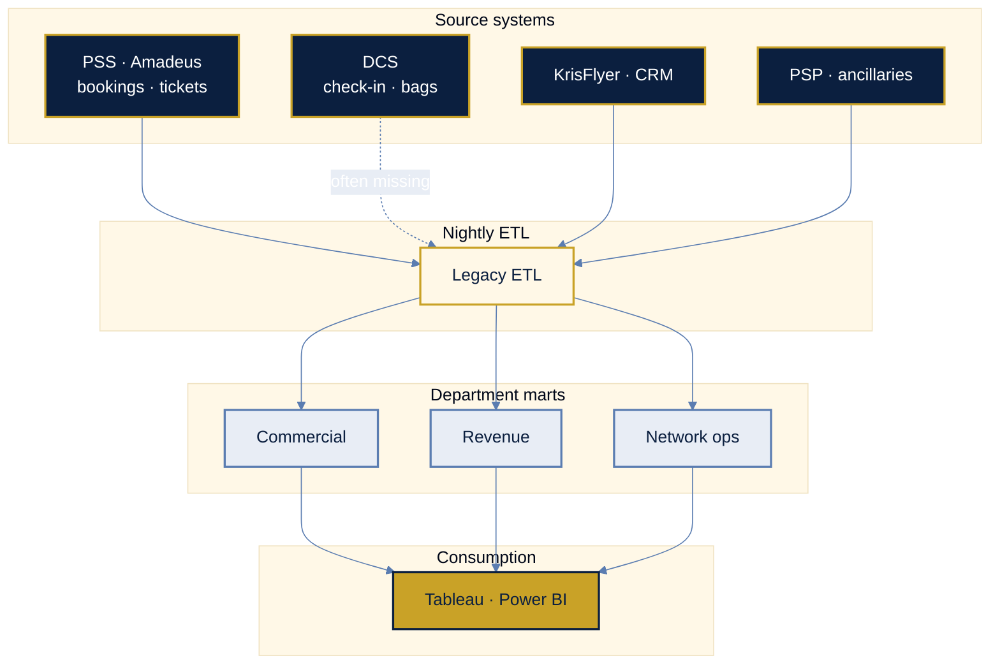
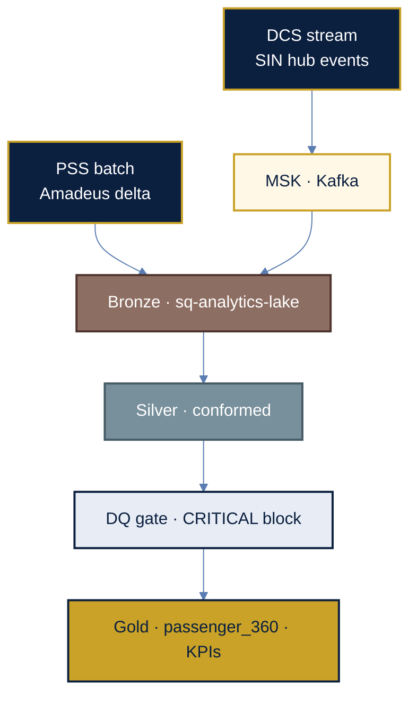
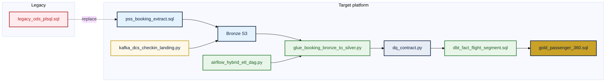
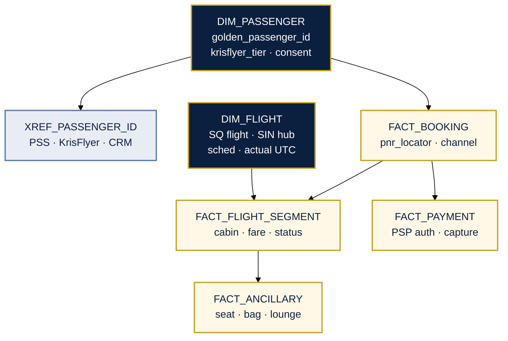

<p align="center">
  
</p>

# Singapore Airlines — Enterprise Data Platform

<p align="center">
  
</p>

| | |
|---|---|
| **Carrier** | Singapore Airlines (IATA **SQ**) · hub **SIN** (Changi) |
| **Loyalty** | KrisFlyer · PPS Club |
| **Sources** | PSS, DCS, PSP, KrisFlyer, RMS, OCC |
| **Stack** | S3 lake · Spark/Glue · Kafka · Airflow · dbt · Snowflake/BigQuery |
| **Environments** | `dev` · `uat` · `prod` — see [`config/platform.yaml`](config/platform.yaml) |

> **Notice:** Architecture and code samples are **illustrative** for data-team review. No production credentials, PNR data, or confidential airline content.

| Acronym | Full name |
|---------|-----------|
| **PSS** | Passenger Service System |
| **DCS** | Departure Control System |
| **OCC** | Operations Control Center |
| **RMS** | Revenue Management System |
| **KrisFlyer** | Frequent-flyer / loyalty program |
| **PNR** | Passenger Name Record |

Glossary: [`docs/00-source-system-glossary.md`](docs/00-source-system-glossary.md)

---

## Contents

1. [Business context](#1-business-context)
2. [Architecture](#2-architecture)
3. [Engineering artifacts](#3-engineering-artifacts)
4. [Gold schema](#4-gold-schema)
5. [Repository layout](#5-repository-layout)

---

## 1. Business context

### 1.1 Current state (typical full-service carrier)

| Dimension | As-is |
|-----------|--------|
| **Commercial** | PSS (Amadeus) = booking system of record |
| **Loyalty** | KrisFlyer DB; tier lag vs PSS **24–48h** |
| **Operations** | DCS check-in; OCC delays — often outside warehouse |
| **Revenue** | RMS + settlement; ancillaries in PSP |
| **Identity** | PNR ID ≠ KrisFlyer ID ≠ CRM contact ID |

### 1.2 Pain points

| Pain | Impact | Symptom |
|------|--------|---------|
| No passenger 360 | Weak personalization | 3+ ID systems |
| Batch T+1 | RMS blind to intraday cancels | 18–36h pipelines |
| Ancillary leakage | Under-reported upsell KPIs | PSP ↔ PNR join breaks |
| OTP mismatch | Ops vs regulatory disagreement | DCS not in warehouse |
| DQ after publish | Wrong gold dashboards | BI finds nulls post-release |

Detail: [`docs/01-business-context.md`](docs/01-business-context.md)

### 1.3 Network KPIs

| KPI | Platform role |
|-----|----------------|
| **Load factor** | Consistent ASK / RPK grain |
| **Yield** | Revenue + RPK; FX + ancillary |
| **Ancillary revenue** | PSP + EMD + flown segment |
| **OTP** | Schedule vs actual (DCS + OCC) |

---

## 2. Architecture

### 2.1 As-is (batch silos)



[`docs/02-as-is-architecture.md`](docs/02-as-is-architecture.md)

### 2.2 Target (lakehouse + streaming)



| Principle | Implementation |
|-----------|----------------|
| **Medallion** | Bronze → Silver → Gold |
| **Passenger SSOT** | `dim_passenger` SCD2 + `xref_passenger_id` |
| **Hybrid ingest** | Batch PSS + Kafka DCS |
| **DQ shift-left** | Block gold on CRITICAL breach |
| **Lineage** | `pipeline_run_id` on every row |

[`docs/03-to-be-architecture.md`](docs/03-to-be-architecture.md)

### 2.3 Medallion flow


---

## 3. Engineering artifacts

### 3.1 Pipeline map



| Layer | Legacy | Target |
|-------|--------|--------|
| Transform | [`legacy_ods_plsql.sql`](samples/legacy_ods_plsql.sql) | [`glue_booking_bronze_to_silver.py`](samples/glue_booking_bronze_to_silver.py) |
| Extract | Full export | [`pss_booking_extract.sql`](samples/pss_booking_extract.sql) |
| Warehouse | Dept ODS | [`dim_passenger_scd2.sql`](samples/dim_passenger_scd2.sql), [`dbt_fact_flight_segment.sql`](samples/dbt_fact_flight_segment.sql) |
| Orchestration | Cron | [`airflow_hybrid_etl_dag.py`](samples/airflow_hybrid_etl_dag.py) |
| Streaming | — | [`kafka_dcs_checkin_landing.py`](samples/kafka_dcs_checkin_landing.py) |
| DQ | Post-BI | [`dq_contract.py`](samples/dq_contract.py), [`dq_load_factor_contract.sql`](samples/dq_load_factor_contract.sql) |
| Mart | Siloed CRM | [`gold_passenger_360.sql`](samples/gold_passenger_360.sql) |

### 3.2 Local validation

```powershell
cd samples
python dq_contract.py
$env:DRY_RUN=1
python glue_booking_bronze_to_silver.py
python kafka_dcs_checkin_landing.py
```

---

## 4. Gold schema



| Table | Type | Sources |
|-------|------|---------|
| **DIM_PASSENGER** | Dimension | KrisFlyer, CRM |
| **XREF_PASSENGER_ID** | Bridge | PSS, KrisFlyer, CRM |
| **DIM_FLIGHT** | Dimension | PSS schedule, OCC actuals |
| **FACT_BOOKING** | Fact | PSS |
| **FACT_FLIGHT_SEGMENT** | Fact | PSS, DCS |
| **FACT_ANCILLARY** | Fact | Catalog, PSP |
| **FACT_PAYMENT** | Fact | PSP |

Full ERD: [`docs/05-database-schema.md`](docs/05-database-schema.md)

---

## 5. Repository layout

```text
├── README.md
├── config/platform.yaml          # env · lake paths · schedules
├── docs/                         # architecture & schema
├── samples/                      # runnable pipeline references
├── .github/workflows/ci.yml      # lint samples on push
└── requirements.txt
```

---

<details>
<summary><em>Internal — capability crosswalk (optional)</em></summary>

| Theme | Proof in repo |
|-------|----------------|
| ETL/ELT | Spark bronze→silver; dbt gold |
| Batch + stream | Airflow + Kafka DCS |
| Governance | SCD2, PII tags, `pipeline_run_id` |
| Airline domain | PSS, DCS, KrisFlyer, RMS, OCC |

</details>

---

*Singapore Airlines data platform reference · for client data-team review.*
