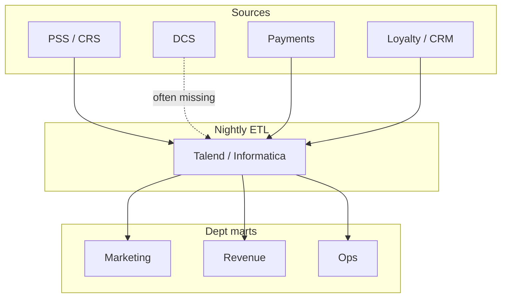
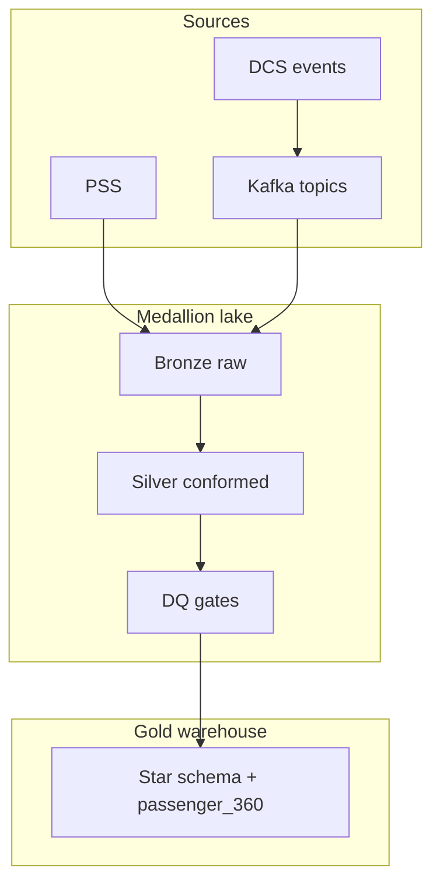
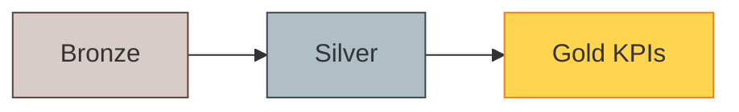
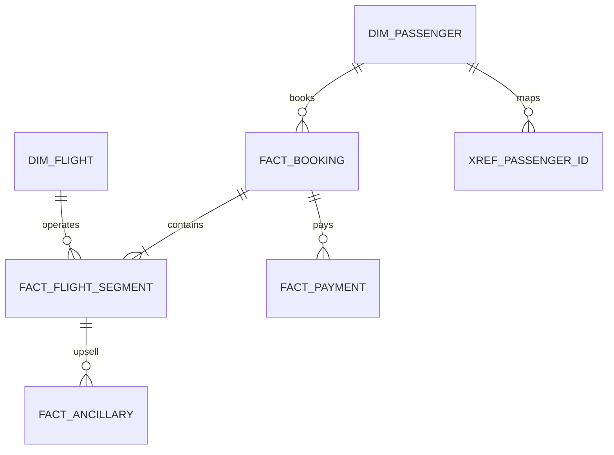

# Airline Domain Data Platform

**Data solution portfolio** for **airline / aviation** data engineering programs: PSS integration (Navitaire, Amadeus, Sabre), loyalty & CRM, revenue management, flight operations, ancillary commerce, and **passenger 360** on a modern **lakehouse** stack.

| Meta | Value |
|------|-------|
| **Domain** | Airline commercial + operational analytics |
| **Sources** | PSS/CRS, DCS, payment, loyalty, RMS, flight ops, ancillary |
| **Stack** | S3 lake, Spark/Glue, Kafka, Airflow, dbt, Snowflake/Redshift/BigQuery |
| **JD alignment** | Data Engineer (Airline Domain) — ETL/ELT, streaming, governance, AI/ML |

> **Disclaimer:** Anonymized **educational case study** for portfolio and interview use. No confidential airline data, production credentials, or proprietary PSS exports.

---

## Table of contents

1. [Business — context & pain points](#1-business--context--pain-points)
2. [Architecture — as-is vs proposed](#2-architecture--as-is-vs-proposed)
3. [Sample engineering code](#3-sample-engineering-code)
4. [Database schema diagram](#4-database-schema-diagram)
5. [JD mapping & interview pitch](#5-jd-mapping--interview-pitch)
6. [Repo map](#6-repo-map)

---

## 1. Business — context & pain points

### 1.1 Current state (typical airline)

| Dimension | As-is reality |
|-----------|---------------|
| **Commercial** | PSS (Amadeus / Sabre / Navitaire) = booking system of record |
| **Ops** | DCS check-in, OCC delays — often **not** in enterprise warehouse |
| **Loyalty** | Separate DB; tier updates lag PSS by 24–48h |
| **Revenue** | RMS + finance settlement; ancillary in payment gateway |
| **Analytics** | Dept marts (marketing, revenue, ops); Excel; legacy ETL |
| **Identity** | PNR passenger ID ≠ loyalty member ID ≠ CRM contact ID |

### 1.2 Pain points

| Pain | Business impact | Engineering symptom |
|------|-----------------|---------------------|
| **No passenger 360** | Personalization fails; duplicate outreach | 3+ ID systems; ad hoc merges |
| **Batch-only T+1** | RMS cannot see intraday cancellations | 18–36h pipeline; no streaming |
| **Ancillary leakage** | Under-reported ancillary KPIs | Payment ↔ PNR join breaks |
| **OTP disagreements** | Ops vs regulatory report mismatch | DCS not in warehouse |
| **Yield / load factor errors** | Wrong network decisions | Mixed leg/segment/OD grain |
| **PII sprawl** | Audit / privacy risk | PNR copied to many marts |
| **DQ after publish** | Wrong dashboards in prod | BI finds nulls post-gold |

**Executive one-liner:**

> *We cannot run yield management, loyalty personalization, and operational control on disconnected batch silos — we need a governed lakehouse, passenger 360, and quality gates before gold KPIs reach the business.*

Detail: [`docs/01-business-context.md`](docs/01-business-context.md)

### 1.3 Airline KPIs (nice-to-have JD)

| KPI | Why data platform matters |
|-----|---------------------------|
| **Load Factor** | Requires consistent ASK / seats sold grain |
| **Yield** | Revenue + RPK; FX and ancillary inclusion |
| **Ancillary Revenue** | Payment + EMD + flown segment linkage |
| **OTP** | Scheduled vs actual; DCS + ops feeds |
| **Revenue Leakage** | Ticket coupon vs flown reconciliation |

---

## 2. Architecture — as-is vs proposed

### 2.1 As-is (batch silos)



Full doc: [`docs/02-as-is-architecture.md`](docs/02-as-is-architecture.md)

### 2.2 Proposed (lakehouse + streaming)



| Principle | Implementation |
|-----------|----------------|
| **Medallion** | Bronze → Silver → Gold |
| **Passenger SSOT** | `dim_passenger` SCD2 + `xref_passenger_id` |
| **Hybrid ingest** | Batch PSS + **Kafka** DCS/payment |
| **DQ shift-left** | Block gold on CRITICAL breach |
| **Lineage** | `pipeline_run_id` on every row |

Full doc: [`docs/03-to-be-architecture.md`](docs/03-to-be-architecture.md) · Summary: [`docs/04-as-is-to-be-summary.md`](docs/04-as-is-to-be-summary.md)

### 2.3 Medallion flow



---

## 3. Sample engineering code

### 3.1 Side-by-side

| Layer | **As-is** | **Proposed** |
|-------|-----------|--------------|
| Transform | [`legacy_ods_plsql.sql`](samples/legacy_ods_plsql.sql) — NVL fare→0 | [`glue_booking_bronze_to_silver.py`](samples/glue_booking_bronze_to_silver.py) |
| Extract | Ad hoc full export | [`pss_booking_extract.sql`](samples/pss_booking_extract.sql) |
| Warehouse | Dept ODS | [`dim_passenger_scd2.sql`](samples/dim_passenger_scd2.sql), [`dbt_fact_flight_segment.sql`](samples/dbt_fact_flight_segment.sql) |
| Orchestration | Cron | [`airflow_hybrid_etl_dag.py`](samples/airflow_hybrid_etl_dag.py) |
| Streaming | N/A | [`kafka_dcs_checkin_landing.py`](samples/kafka_dcs_checkin_landing.py) |
| DQ | Post-BI | [`dq_contract.py`](samples/dq_contract.py), [`dq_load_factor_contract.sql`](samples/dq_load_factor_contract.sql) |
| Mart | Siloed CRM | [`gold_passenger_360.sql`](samples/gold_passenger_360.sql) |

### 3.2 As-is vs proposed — fare handling

**As-is:**

```sql
NVL(s.base_fare, 0) AS base_fare  -- distorts yield when NULL
```

**Proposed:**

```python
# Preserve NULL; quarantine invalid
if base_fare is not None and float(base_fare) < 0:
    return None
```

### 3.3 Quick run (local)

```bash
cd samples
python dq_contract.py
set DRY_RUN=1
python glue_booking_bronze_to_silver.py
python kafka_dcs_checkin_landing.py
```

---

## 4. Database schema diagram

Logical **gold star schema** for bookings, segments, ancillary, payments, and passenger identity.



Full ERD, KPI grains, partitioning: [`docs/05-database-schema.md`](docs/05-database-schema.md)

---

## 5. JD mapping & interview pitch

| JD theme | Portfolio proof |
|----------|-----------------|
| ETL/ELT pipelines | Spark bronze→silver; dbt silver→gold |
| Batch + real-time | Airflow + Kafka DCS landing |
| Data lake / warehouse | Medallion on S3 + cloud DW |
| Airline systems | PSS, DCS, payment, loyalty, RMS, ops mapping table |
| Data quality | `dq_contract.py`, load factor SQL checks |
| Governance | PII tags, SCD2, `pipeline_run_id` lineage |
| AI/ML enablement | `passenger_360`, feature-ready facts |
| Airline KPIs | Load factor, yield, ancillary, OTP, leakage in §1.3 |

**60-second pitch:**

> *I've designed airline analytics platforms that land PSS and DCS on a medallion lakehouse, conform passenger identity for 360, shift DQ left before gold KPIs, and add Kafka for near real-time ops — so revenue, loyalty, and network teams share one governed truth.*

---

## 6. Repo map

```text
airline-domain-data-platform/
├── README.md                 # This file
├── docs/
│   ├── 01-business-context.md
│   ├── 02-as-is-architecture.md
│   ├── 03-to-be-architecture.md
│   ├── 04-as-is-to-be-summary.md
│   └── 05-database-schema.md   # Full ERD + physical hints
├── samples/                  # As-is vs proposed engineering
│   ├── legacy_ods_plsql.sql
│   ├── pss_booking_extract.sql
│   ├── glue_booking_bronze_to_silver.py
│   ├── dim_passenger_scd2.sql
│   ├── dbt_fact_flight_segment.sql
│   ├── kafka_dcs_checkin_landing.py
│   ├── airflow_hybrid_etl_dag.py
│   ├── dq_contract.py
│   ├── dq_load_factor_contract.sql
│   └── gold_passenger_360.sql
└── requirements.txt
```

---

*Portfolio for Data Engineer (Airline Domain) roles — educational case study only.*
