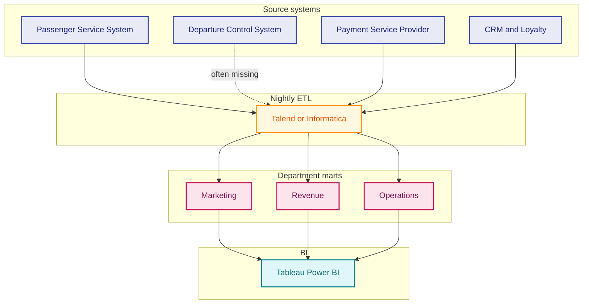
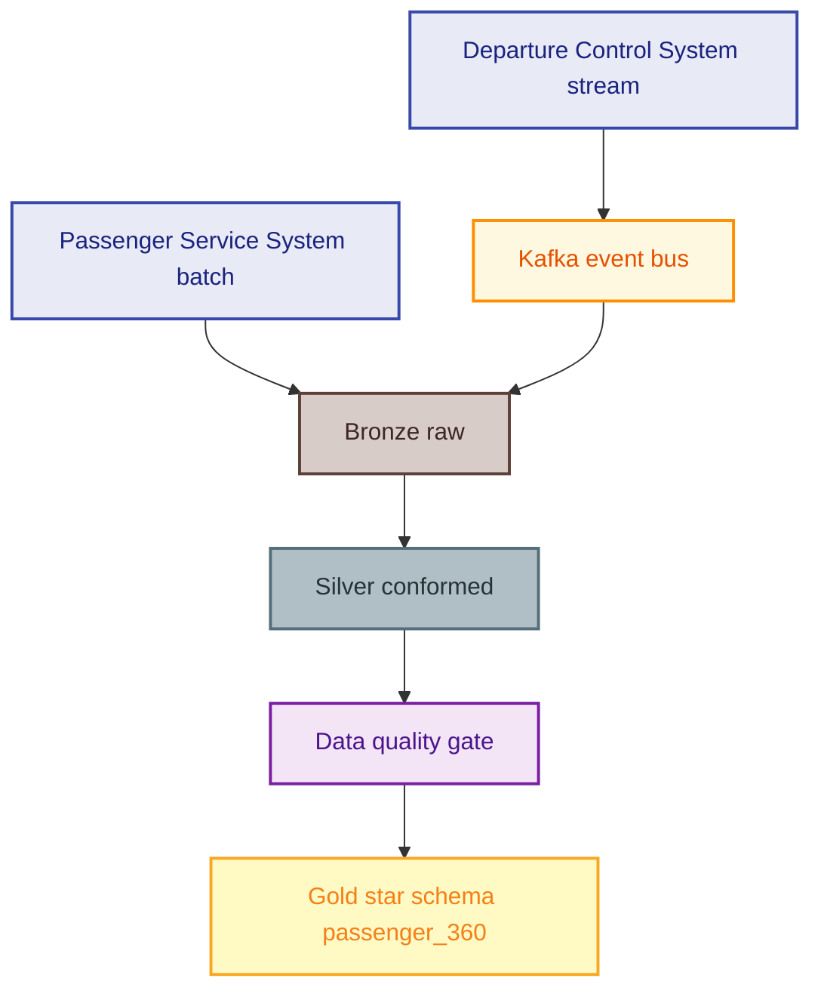
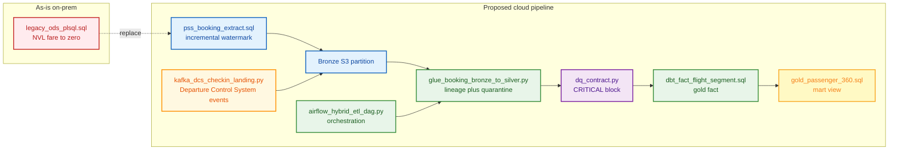
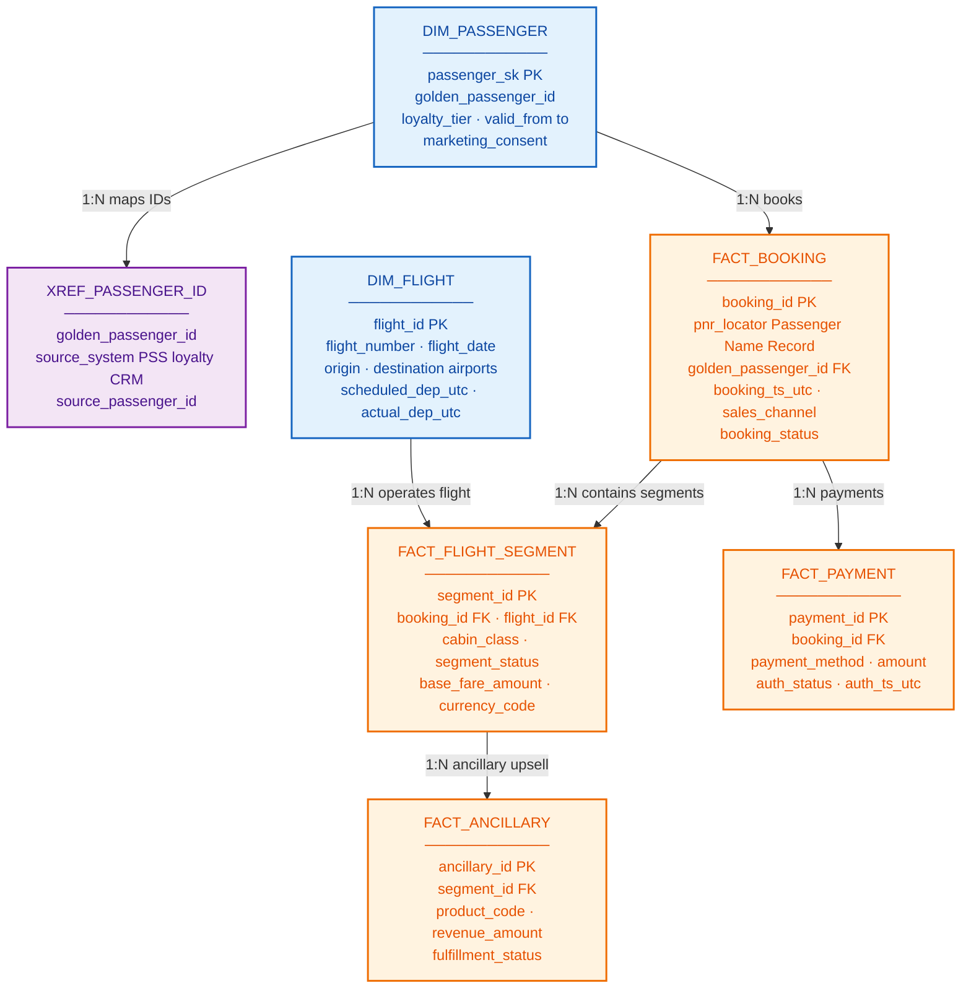

# Airline Domain Data Platform

**Data solution portfolio** for **airline / aviation** data engineering: **Passenger Service System** integration (Navitaire, Amadeus, Sabre), loyalty, **Revenue Management System**, **Departure Control System**, **Operations Control Center**, ancillary commerce, and **passenger 360** on a modern **lakehouse** stack.

| Meta | Value |
|------|-------|
| **Domain** | Airline commercial + operational analytics |
| **Sources** | Passenger Service System, Departure Control System, Payment Service Provider, loyalty, Revenue Management System, Operations Control Center |
| **Stack** | S3 lake, Spark/Glue, Kafka, Airflow, dbt, Snowflake/Redshift/BigQuery |
| **JD alignment** | Data Engineer (Airline Domain) — ETL/ELT, streaming, governance, AI/ML |

> **Disclaimer:** Anonymized **educational case study** for portfolio and interview use. No confidential airline data or production credentials.

### Source system glossary (full English names)

| Acronym | Full name |
|---------|-----------|
| **PSS** | **Passenger Service System** |
| **CRS** | **Computer Reservation System** |
| **DCS** | **Departure Control System** |
| **OCC** | **Operations Control Center** |
| **RMS** | **Revenue Management System** |
| **CRM** | **Customer Relationship Management** |
| **PSP** | **Payment Service Provider** |
| **PNR** | **Passenger Name Record** |
| **OTP** | **On-Time Performance** |

Full definitions: [`docs/00-source-system-glossary.md`](docs/00-source-system-glossary.md)

---

## Table of contents

1. [Business — context & pain points](#1-business--context--pain-points)
2. [Architecture — as-is vs proposed](#2-architecture--as-is-vs-proposed)
3. [Sample engineering code](#3-sample-engineering-code)
4. [Database schema diagram](#4-database-schema-diagram)
5. [JD mapping & interview pitch](#5-jd-mapping--interview-pitch)
6. [Repo map](#6-repo-map)

---

## 1. Business — context & pain points

### 1.1 Current state (typical airline)

| Dimension | As-is reality |
|-----------|---------------|
| **Commercial** | **Passenger Service System** (Amadeus / Sabre / Navitaire) = booking system of record |
| **Operations** | **Departure Control System** check-in; **Operations Control Center** delays — often **not** in enterprise warehouse |
| **Loyalty** | Separate database; tier updates lag Passenger Service System by 24–48h |
| **Revenue** | **Revenue Management System** + finance settlement; ancillary in **Payment Service Provider** |
| **Analytics** | Department marts; Excel; legacy ETL |
| **Identity** | Passenger Name Record ID ≠ loyalty member ID ≠ CRM contact ID |

### 1.2 Pain points

| Pain | Business impact | Engineering symptom |
|------|-----------------|---------------------|
| **No passenger 360** | Personalization fails; duplicate outreach | 3+ ID systems; ad hoc merges |
| **Batch-only T+1** | Revenue Management cannot see intraday cancellations | 18–36h pipeline; no streaming |
| **Ancillary leakage** | Under-reported ancillary KPIs | Payment ↔ Passenger Name Record join breaks |
| **On-Time Performance disagreements** | Ops vs regulatory report mismatch | Departure Control System not in warehouse |
| **Yield / load factor errors** | Wrong network decisions | Mixed leg/segment/origin–destination grain |
| **PII sprawl** | Audit / privacy risk | Passenger Name Record copied to many marts |
| **DQ after publish** | Wrong dashboards in prod | BI finds nulls post-gold |

Detail: [`docs/01-business-context.md`](docs/01-business-context.md)

### 1.3 Airline KPIs

| KPI | Why data platform matters |
|-----|---------------------------|
| **Load Factor** | Consistent available seat kilometers / seats sold grain |
| **Yield** | Revenue + revenue passenger kilometers; FX and ancillary |
| **Ancillary Revenue** | Payment Service Provider + Electronic Miscellaneous Document + flown segment |
| **On-Time Performance** | Scheduled vs actual; Departure Control System + Operations Control Center |
| **Revenue Leakage** | Ticket coupon vs flown reconciliation |

---

## 2. Architecture — as-is vs proposed

### 2.1 As-is (batch silos)



Full doc: [`docs/02-as-is-architecture.md`](docs/02-as-is-architecture.md)

### 2.2 Proposed (lakehouse + streaming)



| Principle | Implementation |
|-----------|----------------|
| **Medallion** | Bronze → Silver → Gold |
| **Passenger SSOT** | `dim_passenger` SCD2 + `xref_passenger_id` |
| **Hybrid ingest** | Batch Passenger Service System + **Kafka** Departure Control System |
| **DQ shift-left** | Block gold on CRITICAL breach |
| **Lineage** | `pipeline_run_id` on every row |

Full doc: [`docs/03-to-be-architecture.md`](docs/03-to-be-architecture.md)

### 2.3 Medallion flow


---

## 3. Sample engineering code

### 3.1 Pipeline flow (as-is vs proposed)



### 3.2 Artifact map

| Layer | **As-is** | **Proposed** |
|-------|-----------|--------------|
| Transform | [`legacy_ods_plsql.sql`](samples/legacy_ods_plsql.sql) | [`glue_booking_bronze_to_silver.py`](samples/glue_booking_bronze_to_silver.py) |
| Extract | Ad hoc full export | [`pss_booking_extract.sql`](samples/pss_booking_extract.sql) |
| Warehouse | Department Operational Data Store | [`dim_passenger_scd2.sql`](samples/dim_passenger_scd2.sql), [`dbt_fact_flight_segment.sql`](samples/dbt_fact_flight_segment.sql) |
| Orchestration | Cron | [`airflow_hybrid_etl_dag.py`](samples/airflow_hybrid_etl_dag.py) |
| Streaming | None | [`kafka_dcs_checkin_landing.py`](samples/kafka_dcs_checkin_landing.py) |
| DQ | Post-BI | [`dq_contract.py`](samples/dq_contract.py), [`dq_load_factor_contract.sql`](samples/dq_load_factor_contract.sql) |
| Mart | Siloed CRM | [`gold_passenger_360.sql`](samples/gold_passenger_360.sql) |

### 3.3 Fare handling — as-is vs proposed

| | Pattern |
|---|---------|
| **As-is** | `NVL(s.base_fare, 0)` — distorts yield when NULL |
| **Proposed** | Preserve NULL; quarantine negative fares in Spark |

### 3.4 Quick run (local)

```powershell
cd samples
python dq_contract.py
$env:DRY_RUN=1
python glue_booking_bronze_to_silver.py
python kafka_dcs_checkin_landing.py
```

---

## 4. Database schema diagram

Logical **gold star schema** — each node lists **key columns** and links to related tables.



### 4.1 Table quick reference

| Table | Type | Links to | Source systems (full name) |
|-------|------|----------|----------------------------|
| **DIM_PASSENGER** | Dimension | `FACT_BOOKING`, `XREF_PASSENGER_ID` | Loyalty platform, Customer Relationship Management |
| **XREF_PASSENGER_ID** | Bridge | `DIM_PASSENGER` | Passenger Service System, loyalty, CRM IDs |
| **DIM_FLIGHT** | Dimension | `FACT_FLIGHT_SEGMENT` | Passenger Service System schedule, Operations Control Center actuals |
| **FACT_BOOKING** | Fact | `FACT_FLIGHT_SEGMENT`, `FACT_PAYMENT` | **Passenger Service System** |
| **FACT_FLIGHT_SEGMENT** | Fact | `FACT_ANCILLARY`, `DIM_FLIGHT` | **Passenger Service System**, **Departure Control System** status |
| **FACT_ANCILLARY** | Fact | `FACT_FLIGHT_SEGMENT` | Ancillary catalog, **Payment Service Provider** |
| **FACT_PAYMENT** | Fact | `FACT_BOOKING` | **Payment Service Provider** |

Full ERD, all columns, partitioning: [`docs/05-database-schema.md`](docs/05-database-schema.md)

---

## 5. JD mapping & interview pitch

| JD theme | Portfolio proof |
|----------|-----------------|
| ETL/ELT pipelines | Spark bronze→silver; dbt silver→gold |
| Batch + real-time | Airflow + Kafka **Departure Control System** landing |
| Data lake / warehouse | Medallion on S3 + cloud warehouse |
| Airline systems | Passenger Service System, Departure Control System, Payment Service Provider, loyalty, Revenue Management System, Operations Control Center |
| Data quality | `dq_contract.py`, load factor SQL checks |
| Governance | PII tags, SCD2, `pipeline_run_id` lineage |
| AI/ML enablement | `passenger_360`, feature-ready facts |

**60-second pitch:**

> *I've designed airline analytics platforms that land **Passenger Service System** and **Departure Control System** data on a medallion lakehouse, conform passenger identity for 360, shift data quality left before gold KPIs, and add Kafka for near real-time **Operations Control Center** inputs — so revenue, loyalty, and network teams share one governed truth.*

---

## 6. Repo map

```text
airline-domain-data-platform/
├── README.md
├── docs/
│   ├── 00-source-system-glossary.md   # PSS, DCS, OCC full English names
│   ├── 01-business-context.md
│   ├── 02-as-is-architecture.md
│   ├── 03-to-be-architecture.md
│   ├── 04-as-is-to-be-summary.md
│   └── 05-database-schema.md          # Full ERD + column tables
├── samples/                           # As-is vs proposed code
└── requirements.txt
```

---

*Portfolio for Data Engineer (Airline Domain) roles — educational case study only.*
