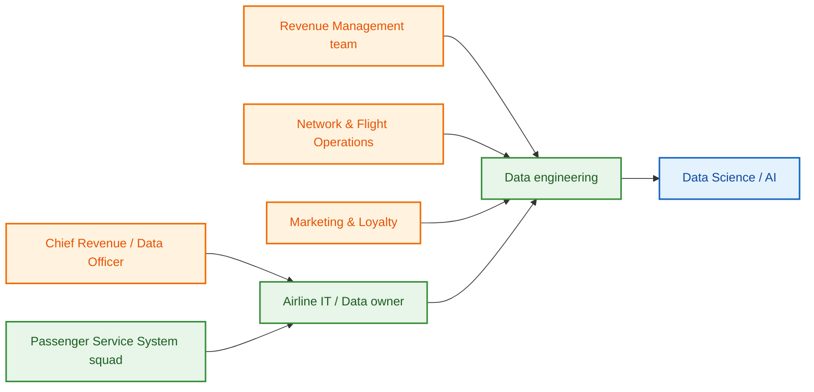

# Business context — airline data platform modernization

> **Disclaimer:** Composite narrative from typical airline / aviation data programs. Educational portfolio — not official airline documentation.

**Source system names:** [`00-source-system-glossary.md`](00-source-system-glossary.md)

---

## 1. Market & strategic drivers

| Driver | Why it matters now |
|--------|-------------------|
| **Recovery & yield pressure** | Post-disruption networks need agile pricing and capacity |
| **Ancillary revenue** | Bags, seats, meals — must be attributed to passenger and flight |
| **Personalization** | Loyalty + Customer Relationship Management need **passenger 360** |
| **Operational resilience** | On-Time Performance, disruption management — near real-time |
| **AI / ML** | Demand forecasting, churn, dynamic offers — needs governed features |
| **Regulatory & privacy** | Passenger Name Record, payment PCI, GDPR/CCPA — lineage and access control |

---

## 2. Stakeholder map



---

## 3. As-is operating model

| Function | Typical behavior | Pain |
|----------|------------------|------|
| **Revenue Management** | Revenue Management System exports + Excel; stale booking snapshots | Cannot react intraday to cancellations |
| **Loyalty** | Separate warehouse from Passenger Service System | Tier status lags 24–48h |
| **Operations** | Aircraft Communications Addressing and Reporting System siloed from commercial | On-Time Performance dashboards disagree with finance |
| **Marketing** | Campaign lists from Customer Relationship Management export | Duplicate passengers (Passenger Name Record vs loyalty ID) |
| **Finance** | General ledger + settlement files T+1 | Ancillary leakage vs flown revenue |
| **Audit** | Sample Passenger Name Record rows in Excel | No lineage from source to KPI |

---

## 4. Pain point deep dive

### 4.1 Passenger / customer fragmentation

- Passenger Service System **passenger_id** ≠ loyalty **member_id** ≠ Customer Relationship Management **contact_id**
- Same person books via online travel agency, airline.com, and call center — weak crosswalk
- **Email / phone** shared in family bookings → false duplicate merges

### 4.2 High-volume transactional lag

```text
Booking (Passenger Service System) → nightly ETL → warehouse → Revenue Management (T+1)
Departure Control System check-in events → not in warehouse → Operations Control Center dashboard manual
```

- Peak: **hundreds of thousands** of booking transactions/day on hub carriers
- Cancellations and schedule changes need **sub-hour** visibility for operations

### 4.3 Revenue leakage & ancillary blind spots

- Seat/bag fees in Payment Service Provider not joined to **flown segment**
- **Yield** and **load factor** computed on different grains (leg vs segment vs origin–destination)
- **Revenue leakage**: flown passengers without matching ticket document

### 4.4 Data quality discovered late

```text
Passenger Service System export → ETL (status code drift) → mart → BI tool
                                      ↑
                            No gate at silver; BI finds On-Time Performance drop weeks later
```

### 4.5 Governance & compliance

- Passenger Name Record **PII** copied to multiple marts without classification
- No standard **audit columns** (`ingest_ts`, `pipeline_run_id`, `source_system`)
- AI teams train on **production snapshots** without anonymization workflow

---

## 5. Airline KPIs (business language)

| KPI | Definition (simplified) | Data pain if broken |
|-----|-------------------------|---------------------|
| **Load Factor** | RPK / ASK (or seats sold / seats available) | Double-count codeshare; wrong cabin grain |
| **Yield** | Revenue / RPK | FX timing; ancillary not in numerator |
| **Ancillary Revenue** | Non-ticket revenue per passenger / flight | Payment ↔ Passenger Name Record join failures |
| **On-Time Performance** | % arrivals within threshold | Operations clock vs published schedule mismatch |
| **Revenue Leakage** | Flown vs billed mismatch | Missing ticket–coupon linkage |

---

## 6. Executive one-liner

> *We cannot run revenue management, loyalty personalization, and operational control on disconnected batch silos — we need a governed lakehouse, passenger 360, and quality gates before gold KPIs reach the business.*

JD alignment: [`../README.md`](../README.md) §5
