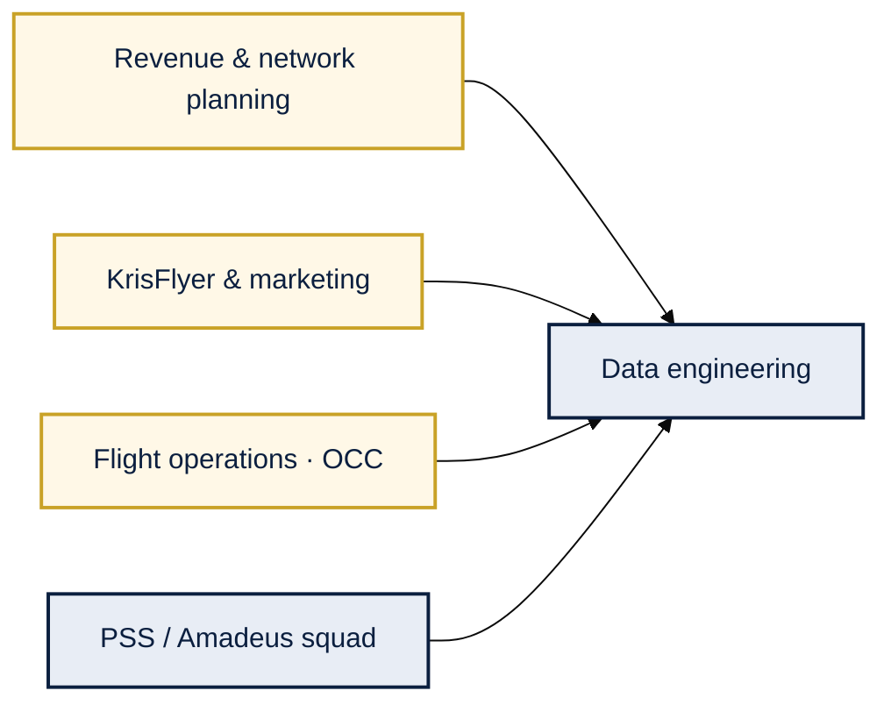

# Business context — Singapore Airlines data platform

> Illustrative discovery narrative for data-team review. Not official SIA documentation.

---

## Strategic drivers

| Driver | Relevance |
|--------|-----------|
| **Network yield** | Long-haul + hub-and-spoke at **SIN** needs consistent segment grain |
| **KrisFlyer personalization** | Tier and miles must align with PSS bookings |
| **Ancillary growth** | Seats, bags, lounge — tied to segment and PSP |
| **OTP & disruption** | OCC + DCS near real-time for ops dashboards |
| **AI / ML** | Demand, churn, offers — governed feature tables |
| **Privacy** | PNR / payment PCI — lineage and RBAC |

---

## Stakeholders

---

## As-is pain (summary)

- **Identity:** PNR ≠ KrisFlyer ID ≠ CRM contact
- **Latency:** Booking T+1; DCS events outside warehouse
- **Ancillary:** PSP payments orphaned from flown segments
- **OTP:** Manual OCC CSV vs warehouse metrics
- **DQ:** Issues found in BI after gold publish

---

## KPI definitions

| KPI | Grain | Risk if wrong |
|-----|-------|---------------|
| Load factor | Flight + cabin + date | Codeshare double-count |
| Yield | OD + cabin + month | FX / ancillary timing |
| Ancillary | Segment | PSP join failure |
| OTP | Flight instance | Schedule vs actual mismatch |

---

## Executive summary

> Unify PSS, KrisFlyer, DCS, and PSP on a medallion lakehouse with passenger 360 and DQ gates before gold KPIs reach commercial and network teams.
