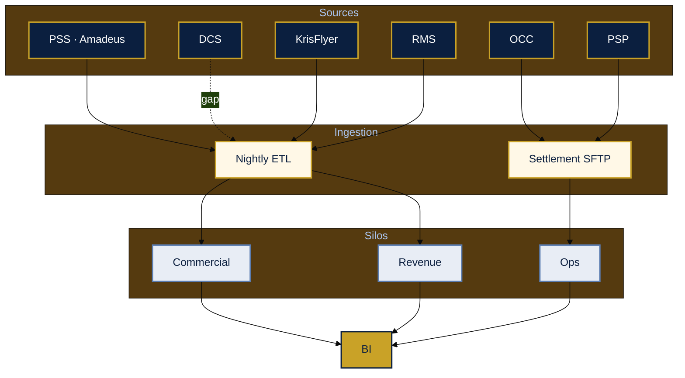

# As-is architecture — pre-lakehouse

---

## Landscape

**Summary:** Batch PSS → department marts; DCS/OCC weakly integrated; no shared bronze or `golden_passenger_id`.

---

## Integration (as-is)

| Source | Pattern | Latency | Failure mode |
|--------|---------|---------|--------------|
| PSS | File dump | T+1 | Partial export after maintenance |
| DCS | Not in DW | — | Ops uses separate tooling |
| KrisFlyer | Weekly batch | T+1–T+7 | Stale tier for campaigns |
| PSP | Settlement CSV | T+2 | Refund / currency mismatch |
| OCC | Manual CSV | Ad hoc | OTP disagreements |

---

## Technical debt

| Area | Symptom |
|------|---------|
| Identity | No golden passenger key |
| Grain | Leg / segment / OD mixed |
| Streaming | No Kafka for DCS |
| DQ | Post-publish discovery |
| Cost | Repeated full PSS extracts |

See [`04-as-is-to-be-summary.md`](04-as-is-to-be-summary.md).
