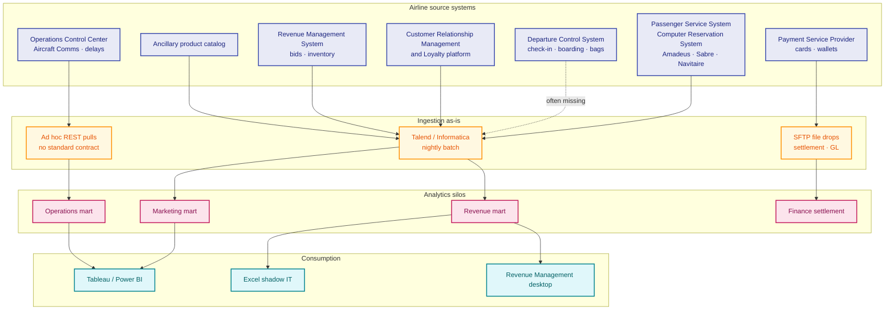

# As-is architecture — airline (pre-modern data platform)

> Hypothesis consolidated from typical full-service and low-cost carrier programs. Validate in discovery.

**Glossary:** [`00-source-system-glossary.md`](00-source-system-glossary.md)

---

## 1. Landscape overview



**One sentence:** Batch ETL from the **Passenger Service System** and satellite systems into **department marts** with **no shared bronze**, **weak passenger crosswalk**, and **limited real-time operations feeds**.

---

## 2. Component map

| Layer | Component | Role | Typical issue |
|-------|-----------|------|---------------|
| Source | Passenger Service System | Bookings, tickets, segments | Schema version drift on export |
| Source | Departure Control System | Check-in, seat, bag tags | Not in nightly warehouse |
| Source | Payment Service Provider | Auth/capture | Hard to tie to coupon level |
| Source | Loyalty platform | Points, tier | Different ID than Passenger Service System |
| Source | Revenue Management System | Forecast, bid prices | Point-in-time snapshots only |
| Source | Operations Control Center | Delays, diversions | Manual CSV uploads |
| Ingest | ETL scheduler | 02:00–06:00 batch window | Overlap with Passenger Service System maintenance |
| Store | Operational Data Store | Per-team tables | Duplicate flight grain |
| Consume | BI / Revenue Management | KPIs | Metric definitions differ by department |

---

## 3. Data journey — ancillary revenue (as-is)

```text
Ancillary purchase (web) → Payment Service Provider (immediate)
    → Passenger Service System Electronic Miscellaneous Document (may lag)
    → Nightly ETL (orphan payments if Passenger Name Record missing)
    → Finance mart (settlement T+2)
    → Ancillary-per-flight dashboard UNDERCOUNT
```

**No data quality gate** between payment and flown segment.

---

## 4. Integration patterns (as-is)

| Source (full name) | Pattern | Latency | Failure mode |
|--------------------|---------|---------|--------------|
| Passenger Service System booking | Full / delta file dump | T+1 | Partial file after VPN blip |
| Departure Control System | Not integrated | — | Operations uses separate tool |
| Payment Service Provider | Settlement CSV | T+1 to T+3 | Currency / refund mismatch |
| Loyalty platform | Weekly batch | T+7 for some programs | Stale tier for campaigns |
| Operations Control Center | Manual CSV upload | Ad hoc | On-Time Performance differs from official report |

---

## 5. Technical debt summary

| Area | As-is symptom |
|------|---------------|
| **Identity** | No `golden_passenger_id` |
| **Grain** | Mixing leg, segment, origin–destination in one fact |
| **Lineage** | Undocumented status code mappings |
| **Streaming** | No Kafka for booking or Departure Control System |
| **DQ** | BI discovers; no block on gold publish |
| **Cost** | Repeated full-table extracts from Passenger Service System |

Summary: [`04-as-is-to-be-summary.md`](04-as-is-to-be-summary.md)
