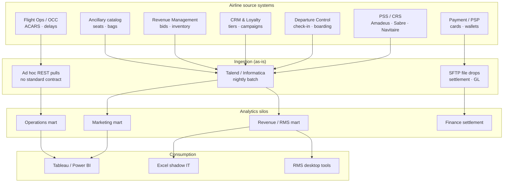

# As-is architecture — airline (pre-modern data platform)

> Hypothesis consolidated from typical full-service and LCC programs using Amadeus, Sabre, Navitaire, or in-house PSS. Validate in discovery.

---

## 1. Landscape overview



**One sentence:** Batch ETL from PSS and satellite systems into **department marts** with **no shared bronze**, **weak passenger crosswalk**, and **limited real-time ops feeds**.

---

## 2. Component map

| Layer | Component | Role | Typical issue |
|-------|-----------|------|---------------|
| Source | PSS (Navitaire / Amadeus / Sabre) | Bookings, tickets, segments | Schema version drift on export |
| Source | DCS | Check-in, seat, bag tags | Not in nightly warehouse |
| Source | Payment gateway | Auth/capture | Hard to tie to coupon level |
| Source | Loyalty | Points, tier | Different ID than PSS |
| Source | RMS | Forecast, bid prices | Point-in-time snapshots only |
| Ingest | ETL scheduler | 02:00–06:00 batch window | Overlap with PSS maintenance |
| Store | Dept ODS | Per-team tables | Duplicate flight grain |
| Consume | BI / RMS | KPIs | Metric definitions differ by dept |

---

## 3. Data journey — ancillary revenue (as-is)

```text
Ancillary purchase (web) → Payment PSP (immediate)
    → PSS EMD (may lag hours)
    → Nightly ETL (orphan payments if PNR not in extract)
    → Finance mart (settlement T+2)
    → "Ancillary per flight" dashboard UNDERCOUNT vs PSP
```

**No DQ gate** between payment and flown segment.

---

## 4. Integration patterns (as-is)

| Source | Pattern | Latency | Failure mode |
|--------|---------|---------|--------------|
| PSS booking | Full / delta file dump | T+1 | Partial file after VPN blip |
| DCS | Not integrated | — | Ops uses separate tool |
| Payments | Settlement CSV | T+1 to T+3 | Currency / refund mismatch |
| Loyalty | Weekly batch | T+7 for some programs | Stale tier for campaigns |
| Flight ops | Manual CSV upload | Ad hoc | OTP % differs from official report |

---

## 5. Technical debt summary

| Area | As-is symptom |
|------|---------------|
| **Identity** | No `golden_passenger_id` |
| **Grain** | Mixing leg, segment, OD in one fact |
| **Lineage** | Undocumented status code mappings |
| **Streaming** | No Kafka / Kinesis for booking or DCS |
| **DQ** | BI discovers; no block on gold publish |
| **Cost** | Repeated full-table extracts from PSS |

Summary: [`04-as-is-to-be-summary.md`](04-as-is-to-be-summary.md)
