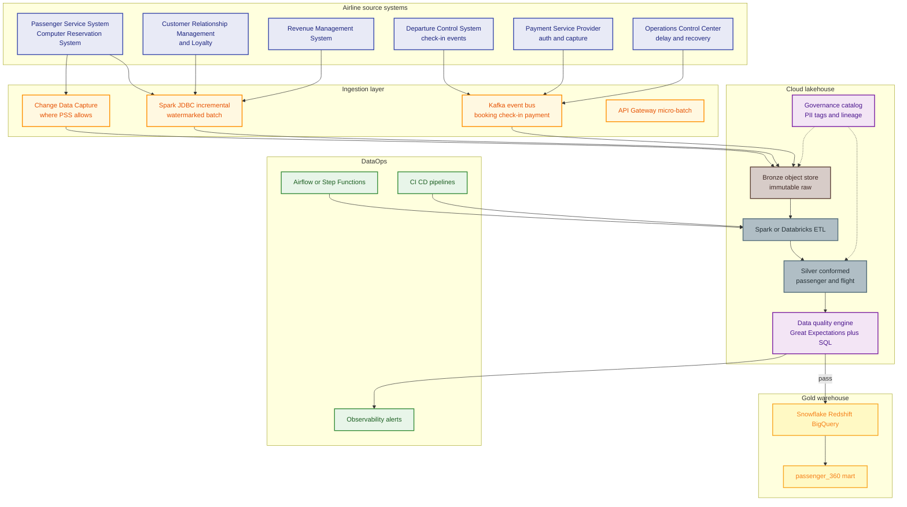
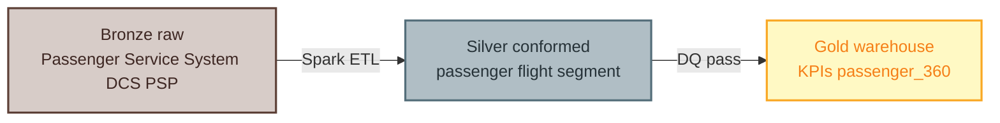
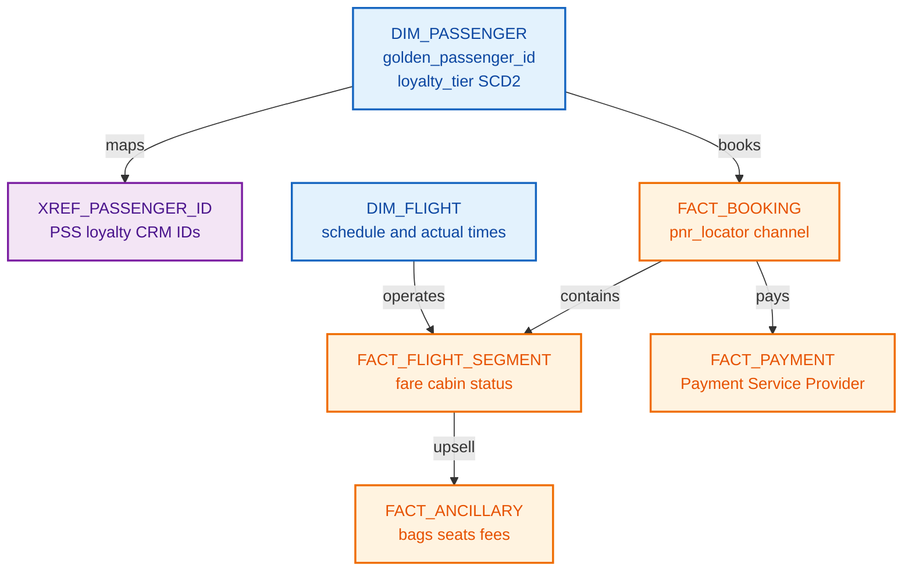

# To-be architecture — airline lakehouse + passenger 360

Target state aligned with **Data Engineer (Airline Domain)** responsibilities: scalable ETL/ELT, real-time ingestion, governance, AI/ML enablement.

**Glossary:** [`00-source-system-glossary.md`](00-source-system-glossary.md)

---

## 1. Target landscape



---

## 2. Medallion tiering



| Tier | Path pattern | Content | Retention |
|------|--------------|---------|-----------|
| **Bronze** | `.../bronze/{system}/{entity}/dt=YYYY-MM-DD/` | Raw PSS, DCS, payment, loyalty | 7+ years (policy) |
| **Silver** | `.../silver/{domain}/{entity}/` | Typed, deduped, `flight_id`, `passenger_id` conformed | 5 years |
| **Gold** | `gold.*` in warehouse | Star schema, KPI marts, ML features | Current + SCD history |

**Standard audit columns:** `ingest_ts`, `source_system`, `source_record_id`, `pipeline_run_id`, `record_hash`

---

## 3. Passenger 360 (Single Source of Truth) model



**Rule:** Preserve **declared** loyalty tier from source; use **estimated_*** only for ML features with `is_imputed` flag.

Full schema reference: [`05-database-schema.md`](05-database-schema.md)

---

## 4. Real-time vs batch patterns

| Pattern | When | Tool | Example |
|---------|------|------|---------|
| Full snapshot (small ref) | Daily airports, aircraft | Spark JDBC | `dim_airport` |
| Incremental watermark | PSS booking delta | `last_modified_ts` | `fact_booking` silver |
| Event stream | DCS check-in, payment auth | Kafka → bronze | Near real-time OTP inputs |
| CDC | If airline enables | Debezium / DMS | Low-latency seat changes |

**Timezone:** Store **UTC** in warehouse; expose **local station** in gold views for ops.

---

## 5. DQ shift-left

```text
Bronze ──► schema contract (PSS version)
Silver ──► uniqueness PNR+segment, referential flight_id
Gold   ──► business rules (flown segment must have ticket coupon)
         ──► BLOCK publish if severity=CRITICAL
```

Critical rules (examples):

- `pnr_locator` not null in silver booking
- Duplicate `segment_id` above threshold → quarantine
- Load factor inputs: **no negative ASK**; cabin grain documented

---

## 6. AI / ML enablement

| Use case | Gold / feature layer |
|----------|----------------------|
| Demand forecasting | `feature_flight_od_daily` from RMS + historical bookings |
| Churn / loyalty | `feature_passenger_rfm` from booking + ancillary |
| Personalization | `passenger_360` + consent flags |
| Ops optimization | `feature_flight_delay_risk` from ops + weather (optional) |

---

## 7. Security & governance

| Control | Implementation |
|---------|----------------|
| PNR / PII | Column tags `PII`, `FINANCIAL`; mask in bronze reads |
| Payment | PCI scope minimized — tokenized IDs only in lake |
| Lineage | OpenLineage / Databricks lineage on every pipeline |
| Access | RBAC by domain: `revenue_read`, `ops_read`, `ml_feature_read` |

---

## 8. Migration roadmap (phased)

| Phase | Focus |
|-------|-------|
| 0 | Landing zone, IAM, catalog, CI/CD |
| 1 | Booking bronze/silver + `dim_passenger` / xref |
| 2 | DCS + payment streaming → ops & ancillary gold |
| 3 | RMS + loyalty integration; decommission dept marts |
| 4 | ML feature store + real-time personalization API |

Summary: [`04-as-is-to-be-summary.md`](04-as-is-to-be-summary.md)
