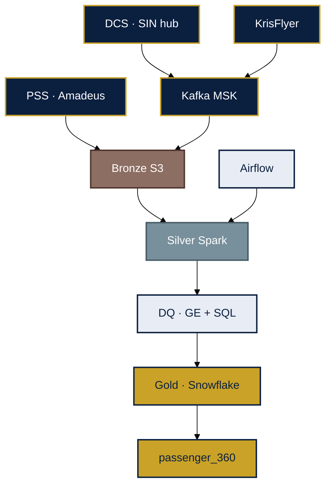
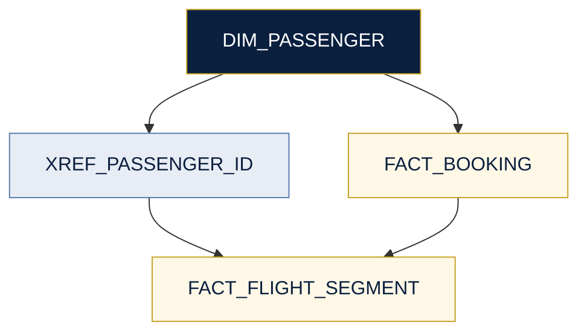

# Target architecture — SQ lakehouse + passenger 360

**Config:** [`../config/platform.yaml`](../config/platform.yaml)

---

## Target landscape



---

## Medallion

| Tier | Path | Content |
|------|------|---------|
| Bronze | `bronze/{system}/{entity}/dt=` | Raw PSS, DCS, PSP, KrisFlyer |
| Silver | `silver/{domain}/{entity}/` | Conformed passenger, flight, segment |
| Gold | `gold.*` | Star schema, KPIs, ML features |

**Audit columns:** `ingest_ts`, `source_system`, `pipeline_run_id`, `record_hash`

---

## Passenger 360



Schema: [`05-database-schema.md`](05-database-schema.md)

---

## Ingest patterns

| Pattern | Use | Example |
|---------|-----|---------|
| Incremental watermark | PSS booking delta | `fact_booking` |
| Event stream | DCS check-in | Kafka → bronze |
| Daily snapshot | Airports, aircraft | `dim_airport` |

Store **UTC** in warehouse; expose local station in gold views.

---

## DQ (shift-left)

```text
Bronze → PSS schema version contract
Silver → PNR uniqueness, flight_id referential
Gold   → BLOCK on CRITICAL (negative ASK, orphan ancillary)
```

---

## Migration phases

| Phase | Deliverable |
|-------|-------------|
| 0 | Landing zone, IAM, catalog, CI/CD |
| 1 | PSS bronze/silver + `dim_passenger` |
| 2 | DCS stream + ancillary gold |
| 3 | RMS + KrisFlyer; retire dept marts |
| 4 | ML features + personalization API |
