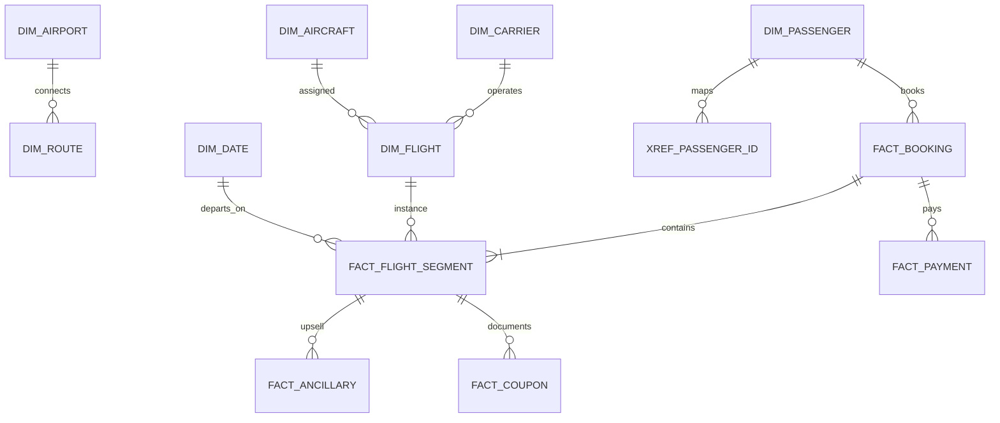
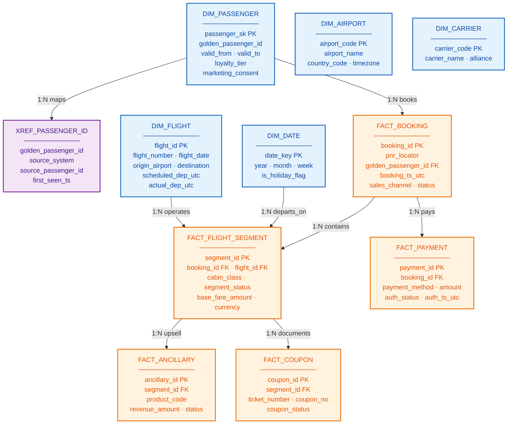

# Database schema — airline analytics (gold layer)

Logical **star schema** for commercial + operational analytics. Physical implementation: Snowflake, Redshift, BigQuery, or Databricks SQL.

System names: [`00-source-system-glossary.md`](00-source-system-glossary.md)

---

## 1. Entity-relationship diagram (relationships only — GitHub-safe)

> GitHub Mermaid `erDiagram` does not support `NK` markers or types like `date` / `decimal` in attribute blocks. Relationships are shown here; **column detail** is in §2 (colored flowchart) and §3 (tables).

---

## 2. Detailed gold schema (colored — key columns per table)

---

## 3. Table definitions (full column list)

### Dimensions

| Table | Key columns | Purpose |
|-------|-------------|---------|
| **DIM_PASSENGER** | `passenger_sk`, `golden_passenger_id`, `valid_from`, `valid_to`, `is_current`, `loyalty_tier`, `loyalty_points_balance`, `marketing_consent` | Passenger SSOT (SCD2) |
| **XREF_PASSENGER_ID** | `golden_passenger_id`, `source_system`, `source_passenger_id`, `first_seen_ts`, `last_seen_ts` | Maps PSS / loyalty / CRM IDs |
| **DIM_FLIGHT** | `flight_id`, `carrier_code`, `flight_number`, `flight_date`, `origin_airport_code`, `destination_airport_code`, `scheduled_dep_utc`, `actual_dep_utc` | Flight instance for OTP / load factor |
| **DIM_DATE** | `date_key`, `year`, `month`, `week_of_year`, `is_holiday_flag` | Calendar for aggregations |
| **DIM_AIRPORT** | `airport_code`, `airport_name`, `country_code`, `timezone_iana` | Station reference |
| **DIM_CARRIER** | `carrier_code`, `carrier_name`, `alliance_code` | Operating / marketing carrier |
| **DIM_AIRCRAFT** | `aircraft_registration`, `aircraft_type`, seat capacities by cabin | Capacity for ASK |

### Facts

| Table | Key columns | Purpose |
|-------|-------------|---------|
| **FACT_BOOKING** | `booking_id`, `pnr_locator`, `golden_passenger_id`, `booking_ts_utc`, `sales_channel`, `booking_status` | Commercial booking header |
| **FACT_FLIGHT_SEGMENT** | `segment_id`, `booking_id`, `flight_id`, `departure_date_key`, `cabin_class`, `segment_status`, `base_fare_amount`, `taxes_amount` | Ticket segment grain (yield, load factor) |
| **FACT_ANCILLARY** | `ancillary_id`, `segment_id`, `product_category`, `product_code`, `revenue_amount`, `fulfillment_status` | Bags, seats, meals revenue |
| **FACT_PAYMENT** | `payment_id`, `booking_id`, `payment_method`, `amount`, `auth_status`, `auth_ts_utc` | Payment Service Provider linkage |
| **FACT_COUPON** | `coupon_id`, `segment_id`, `ticket_number`, `coupon_number`, `coupon_status` | Revenue leakage reconciliation |

---

## 4. KPI grain definitions

| KPI | Recommended grain | Key tables |
|-----|-------------------|------------|
| **Load Factor** | Flight + cabin + departure date | `FACT_FLIGHT_SEGMENT`, `DIM_FLIGHT` |
| **Yield** | Origin–destination + cabin + month | `FACT_FLIGHT_SEGMENT` + revenue fields |
| **Ancillary Revenue** | Segment or passenger–flight | `FACT_ANCILLARY` |
| **OTP** | Flight instance (actual vs scheduled) | `DIM_FLIGHT` + Departure Control System enrich |
| **Revenue Leakage** | Coupon vs flown segment | `FACT_COUPON` join `FACT_FLIGHT_SEGMENT` |

---

## 5. SCD2 — passenger dimension

| Column | Type | Notes |
|--------|------|-------|
| `passenger_sk` | BIGINT | Surrogate primary key |
| `golden_passenger_id` | VARCHAR | Natural key — stable across sources |
| `valid_from` / `valid_to` | DATE | SCD2 window |
| `is_current` | BOOLEAN | Current row flag |
| `loyalty_tier` | VARCHAR | From loyalty system — not overwritten by ML |

---

## 6. Indexing and partitioning (physical hints)

| Table | Partition | Cluster / sort |
|-------|-----------|----------------|
| `FACT_FLIGHT_SEGMENT` | `departure_date_key` | `flight_id`, `booking_id` |
| `FACT_BOOKING` | `booking_ts_utc` (month) | `pnr_locator` |
| `FACT_ANCILLARY` | `purchase_ts_utc` (month) | `segment_id` |
| `DIM_PASSENGER` | N/A (slowly changing) | `golden_passenger_id` |

---

## 7. Source-to-target mapping (full English system names)

| Source system (full name) | Bronze entity | Silver entity | Gold table |
|---------------------------|---------------|---------------|------------|
| **Passenger Service System** (Navitaire / Amadeus / Sabre) | `booking_raw`, `segment_raw` | `booking_conformed` | `FACT_BOOKING`, `FACT_FLIGHT_SEGMENT` |
| **Departure Control System** | `checkin_event` | `segment_status_enriched` | `FACT_FLIGHT_SEGMENT.segment_status` |
| **Payment Service Provider** | `payment_auth` | `payment_conformed` | `FACT_PAYMENT` |
| **Loyalty platform** | `member_profile` | `passenger_conformed` | `DIM_PASSENGER`, `XREF_PASSENGER_ID` |
| **Revenue Management System** | `bid_price_snapshot` | `flight_inventory` | Yield features (adjacent mart) |
| **Operations Control Center** / flight ops | `delay_event` | `flight_actual_times` | `DIM_FLIGHT` OTP enrich |
