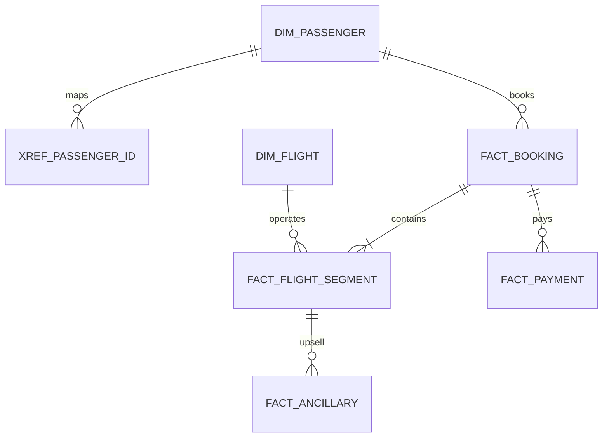
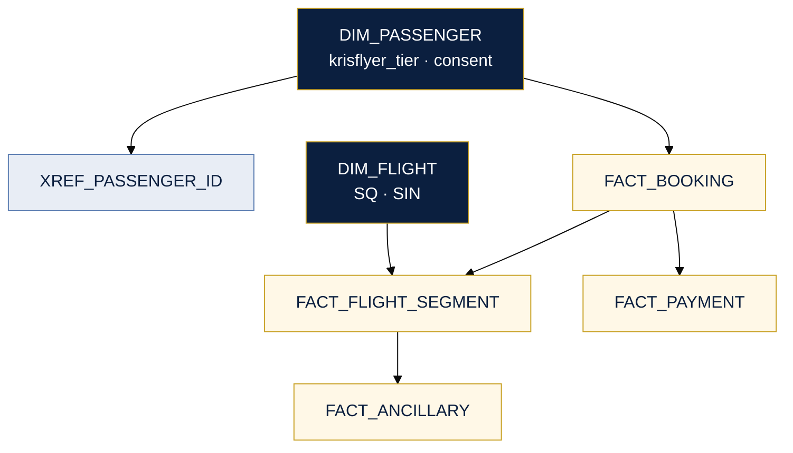

# Gold schema — Singapore Airlines analytics

Physical target: Snowflake / BigQuery / Databricks SQL.

---

## Relationships

---

## Core model (key columns)

---

## Tables (abbreviated)

| Table | Purpose |
|-------|---------|
| **DIM_PASSENGER** | SCD2 SSOT; KrisFlyer tier from source only |
| **XREF_PASSENGER_ID** | PSS / KrisFlyer / CRM crosswalk |
| **DIM_FLIGHT** | Schedule + OCC actuals for OTP |
| **FACT_BOOKING** | PNR header, channel |
| **FACT_FLIGHT_SEGMENT** | Yield / load factor grain |
| **FACT_ANCILLARY** | Seat, bag, lounge revenue |
| **FACT_PAYMENT** | PSP linkage |

---

## KPI grain

| KPI | Grain | Tables |
|-----|-------|--------|
| Load factor | Flight + cabin + date | `FACT_FLIGHT_SEGMENT`, `DIM_FLIGHT` |
| Yield | OD + cabin + month | `FACT_FLIGHT_SEGMENT` |
| Ancillary | Segment | `FACT_ANCILLARY` |
| OTP | Flight instance | `DIM_FLIGHT` + DCS |

---

## Partitioning

| Table | Partition | Cluster |
|-------|-----------|---------|
| `FACT_FLIGHT_SEGMENT` | `departure_date_key` | `flight_id` |
| `FACT_BOOKING` | `booking_ts_utc` (month) | `pnr_locator` |
| `DIM_PASSENGER` | — | `golden_passenger_id` |

---

## Source mapping

| Source | Bronze | Gold |
|--------|--------|------|
| PSS (Amadeus) | `booking_raw` | `FACT_BOOKING`, `FACT_FLIGHT_SEGMENT` |
| DCS | `checkin_event` | `segment_status` enrich |
| KrisFlyer | `member_profile` | `DIM_PASSENGER`, `XREF` |
| PSP | `payment_auth` | `FACT_PAYMENT` |
| OCC | `delay_event` | `DIM_FLIGHT` actual times |
